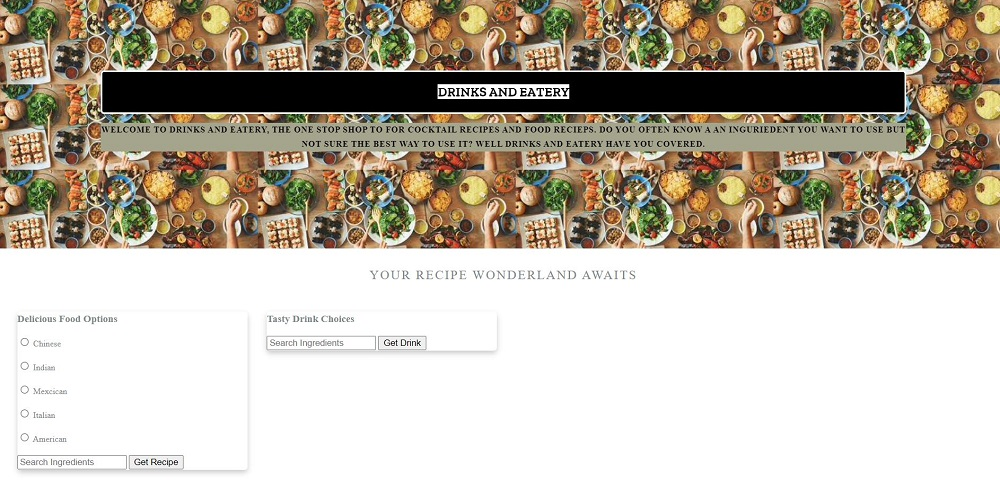
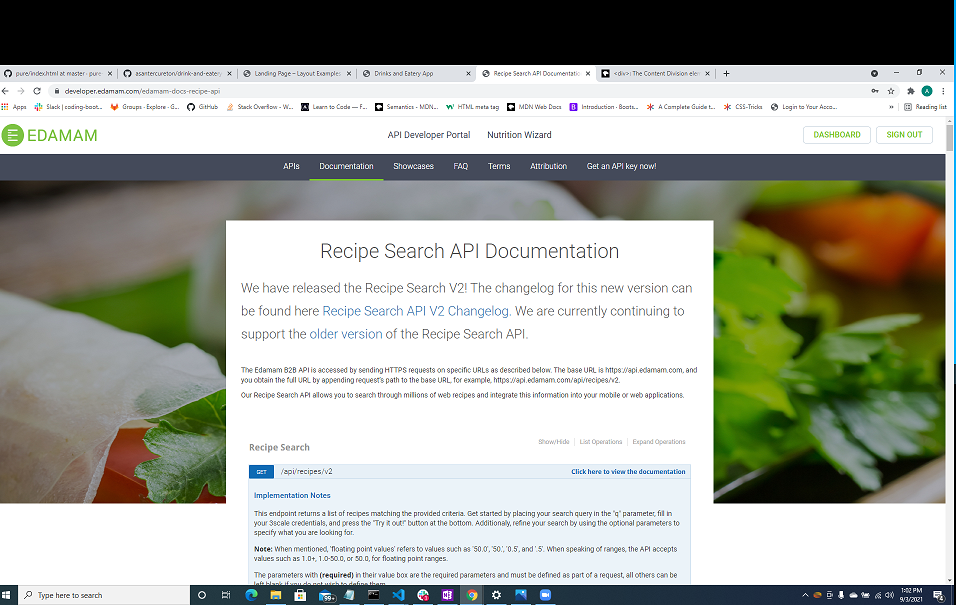
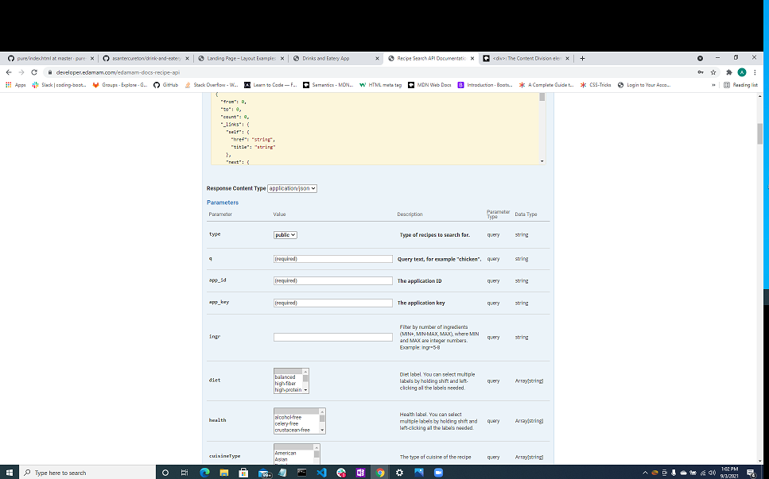
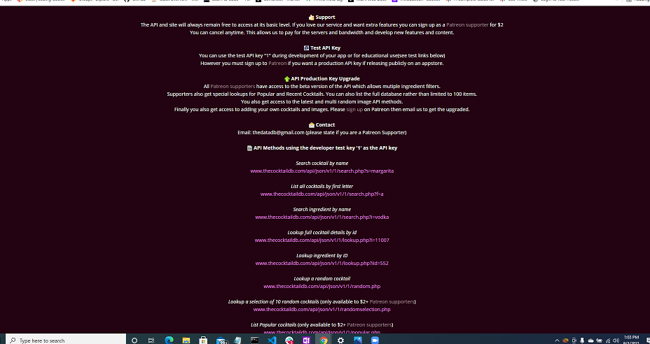

# drink-and-eatery-app

## Name
Drink And Eatery App

## Contributors
Asante Cureton

Ariell Scott

Lucy Onoh

Bilal Alboga

## Description
Designed a clean professional web application to allow food and drink novices to search for unique and creative recipes to broaden their horizon.

## Links
[Source Code](https://github.com/asantercureton/drink-and-eatery-app/)

[Description Link](https://asantercureton.github.io/drink-and-eatery-app/)

## Usage
As a user, I select a radio button within the food options to specify a food cuisine, then search for a particular food ingredient to retrieve a list of recipes with image and serving size. I input an ingredient within the search bar of the drink section to retrieve a list of drink recipes with image, ingredients and instructions.

## Screenshots
Below is a screenshot of the project:

---
© 2021 Drink and Eatery App.